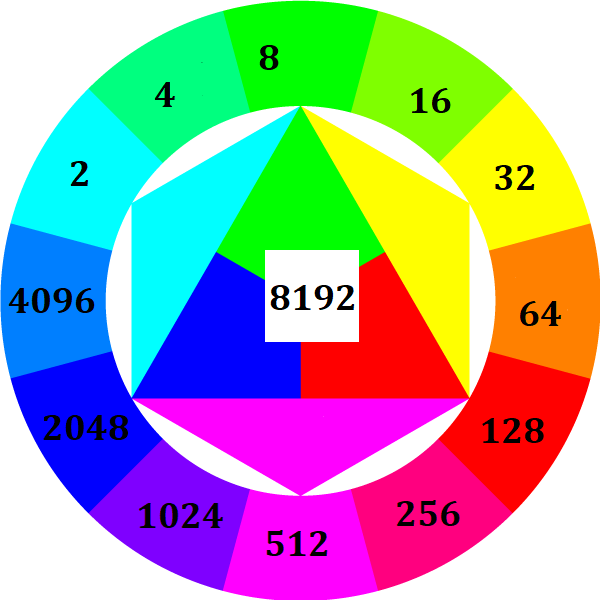

# 2048 Game  
  
*Création du jeu __2048__ pour le sensehat du RapberryPi*  
***
### Règles :
Le but du jeu est de faire le plus haut score possible en combinant des blocs de même valeurs (ici représenté par la couleur).  
La partie se termine sous deux conditions:  
* Tous l'espace et rempli, et aucune combinaison n'est possible, à ce mooment le joueur gagne le nombre de points egal à la plus haute valeur qu'il a réussi à produire
* Le joueur arrive à réunir deux symboles blancs, et gagne contre le jeu, car il n'y a plus d'autres couleurs disponibles.  
  
### Prise en main : 

Le principe premier du jeu est que tous les blocs vont se déplacer dans la mesure du possible (soit jusqu'à ce qu'un bloc d'une couleur différente du premier l'en empêche) dans la direction indiquée par le joueur. Pour pouvoir déplacer les blocs, le joueur sera muni du joystick.

### Couleurs:

Les couleurs pour le **2048** sont appliquées comme suit:

Le format des couleurs étant converti par la led du format RGB888 (8bits R, 8bits G, 8bits B) au formats RGB565 (5 pour R, 6 pour G, 5 pour B). Le blanc se tansforme de (255, 255, 255) en (248, 252, 248). Chaque niveau sera en effet descendu de manière à atteindre le seuil suivant divisible par 8 pour R et B, et par 2 pour G.
