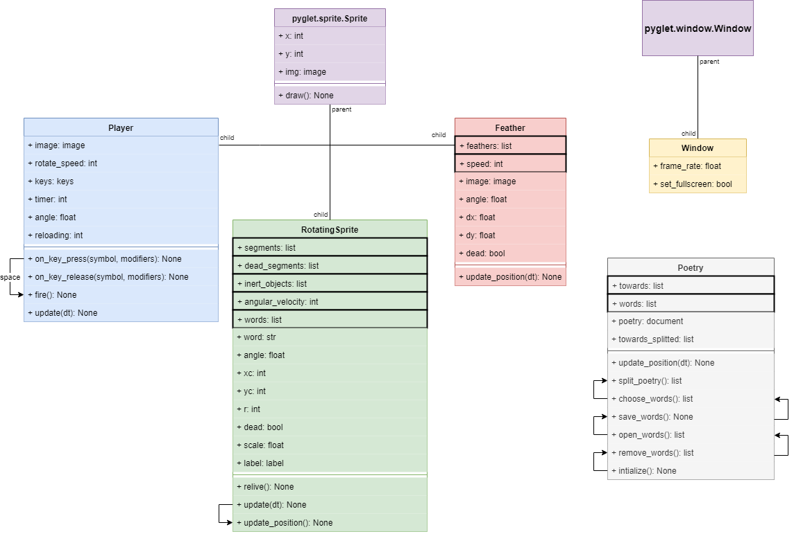

# Circles

* Authors: Massimo Stefani, Valentin Piquerez et Hugo Ducommun
* Date: 23/05/2019

# Sommaire

1. [Introduction](#introduction)
    * [Côté poétique](#côté-poétique)
2. [Explication du jeu](#explication-du-jeu)
3. [Structure du programme](#structure-du-programme)
4. [Conclusion]()

## Description

### Introduction

Nous vivons dans un monde où l’Informatique prend de plus en plus d’importance dans notre vie. Que ce soit pour notre loisir ou notre confort, nous sommes constamment face à des dispositifs qui font aujourd’hui partie de notre vie quotidienne. Le travail d’un informaticien est celui de permettre l’interaction entre un être humain et une machine. Il conçoit des logiciels qui lient le monde réel et le monde constitué de 1 et 0.

Tout comme les informaticiens, nous aimons créer des choses. Nous avons ce plaisir de concevoir des programmes qui pourront être utilisés par la suite seulement pour l’amour de l’art. C’est pour cela que nous avons choisi Informatique comme Option complémentaire. Nous avons eu l’opportunité de créer pour notre examen final un jeu vidéo interactif et défendre celui-ci devant deux experts qui jugeront notre rendu final.

Pour ce projet, des conditions ont été imposées par notre enseignant. En effet, la difficulté de ce dernier était de créer un jeu vidéo ayant un côté poétique en raison de la semaine de la poésie dans le Gymnase du Bugnon. Nous devions imaginer, structurer et créer un jeu vidéo à partir de rien.

Ce travail nous a donc permis de remettre en question nos idées et nos capacités : on a été emmené à discuter entre nous afin d’arriver à terrain d’entente qui satisfasse tous les membres du groupe et nous devions penser à un gameplay divertissant, mais étant en accord avec nos connaissances du langage.

#### Côté poétique

Le sujet de ce travail de fin d’année, consistait à créer un projet dans lequel la poésie jouait un rôle important. Ceci était donc notre critère primordial, nous devions donc concevoir un jeu avec une atmosphère "poétique".

Pour cela nous avons conçu un jeu qui consiste à compléter des lacunes d'un poème, tout en restant dans thème poétique. Le choix de nos sprites a donc été méthodique pour le respecter.

| Projectile    | Player | Parchemin  |
| :-------------: |:------:| :----------:|
|       |  |  |

Nous avons donc ajouté des sprites représentants l’écriture : un encrier étant la source des projectiles, un parchemin étant l'endroit sur lequel on écrit et une musique classique représentant la douceur de cet art.

### Explication du jeu

Le but du jeu est de compléter les lacunes d'un poèmes. Pour celà, le joueur est muni d'un encrier qui tire des plumes. Cet encrier est au centre d'un cercle constitué de 15 mots qui tourne. Il faut tirer sur le mot qui manque dans le vers affiché pour passer au vers suivant jusqu'à ce que le poème soit complété.

#### Touches

* Barre espace : tirer les projectiles
* Flèches gauche-droite : faire tourner l'encrier

### Structure du programme

Notre jeu est composé de deux fichiers: le `classes.py` et le `circles.py`.

Pour mieux se représenter la structure du programme, voici un diagramme UML (Unified Modeling Language). Il illustre les classes, leurs attributs et leurs méthodes de manière graphique.

Nous pouvons noter que chaque classe possède une méthode `update` qui permet d'actualiser chaque attributs de l'instance et par conséquent rendre le jeu dynamique.

#### *Player*

Notre jeu est donc composé de la classe **Player**, attribuée au joueur. Elle gère les mouvements de ce dernier (grâce aux méthodes `on_key_press` et `on_key_release`) et les tirs du joueur (méthode `fire`). Elle hérite également des méthodes de Sprite de pyglet ([Pyglet Sprite Documentation](https://pyglet.readthedocs.io/en/pyglet-1.3-maintenance/modules/sprite.html))

Cette classe a pour attribut :
* image : L'image associée à l'instance (encrier)
* rotate_speed : Il s'agit d'une constante qui définit la vitesse de rotation du joueur
* keys : Assigne la valeur `False` aux flèches droite et gauche qui contrôle le mouvement.
* timer : Un attribut pratique pour récupérer l'angle actuel du joueur (peut être négatif)
* angle : = timer * rotate_speed. C'est l'angle que forme la position du joueur.
* reloading : Le temps que prends le joueur à recharger un projectile. Attention cet attribut décremente de 1 chaque 60ème de seconde.

#### *Feather*

Cette classe fille de la classe Sprite de pyglet, est attribuée aux projectiles (plumes) que lance le joueur à chaque fois qu'il appuie sur la barre espace. Elle ne possède que la méthode `update` car les plumes sont des objets qui, une fois lancées, n'intéragissent pas avec les actions du joueur. Leur seule intéraction est lorsque ces dernières touchent un segment, elles s'arrêtent et se transforment en `RotatingSprite`, que nous définirons plus tard.

Cette classe a pour attribut de classe :
* feathers : C'est une liste sous forme d'attibut de classe qui contient tout les projectiles lancés.
* speed : _Norme_ de la vitesse

Cette classe a pour attribut d'instance :
* image : Image du projectile
* dx : Projection de _Feather.speed_ sur l'axe X.
* dy : Projection de _Feather.speed_ sur l'axe Y.
* angle : L'angle du joueur lorsque ce dernier a tiré
* dead : Définit si la plume est morte, dans le cas échéant, l'instancie dans RotatingSprite pour qu'elle soit comme plantée dans un segment.

#### *RotatingSprite*

Cette classe fille de la classe Sprite de pyglet, est attribuée aux sprites tournant (plumes mortes, segments de cercle et segments de cercle morts).

Ses méthodes sont :
* relive() : Permet de faire revivre un segment mort lorsqu'on appuie sur le bouton Restart.
* update(dt) : Vérifie si le segment est devenu mort, si oui lui supprime son mot assigné et réctifie son image en dead segment. Puis met à jour l'angle de l'instance pour qu'elle tourne. Ensuite appelle la méthode `update_position`.
* update_position() : Assigne la nouvelle position à l'instance ainsi qu'au mot qui lui ai assigné si elle en possède un (par exemple les dead_segments et les projectiles n'ont pas de mot qui leur sont assigné).

Cette classe a pour attribut de classe :
* segments : La liste des segments vivants
* dead_segments : La liste des segments morts
* inert_objects : La liste des projectils morts qui tournent désormais
* angular_velocity : Une constante qui définit la vitesse angulaire des instances.
* words : La liste de 15 mots qui rempliront les lacunes

Cette classe a pour attribut d'instance :
* word : Correspond au mot de l'instance si c'est un segment vivant. Fait partie de `RotatingSprite.words`
* angle : C'est l'angle actuel de l'instance
* xc : La coordonée X du centre autour duquel tourne le sprite
* yc : La coordonée Y du centre autour duquel tourne le sprite
* r : Le rayon de la rotation. Donc la distance entre le centre et l'instance qui tourne
* scale : La mise à l'échelle de l'instance
* label : Le label auquel est affecté le `self.word`
* dead : L'état de l'instance, mort ou vivant (True ou False)

### Conclusion
